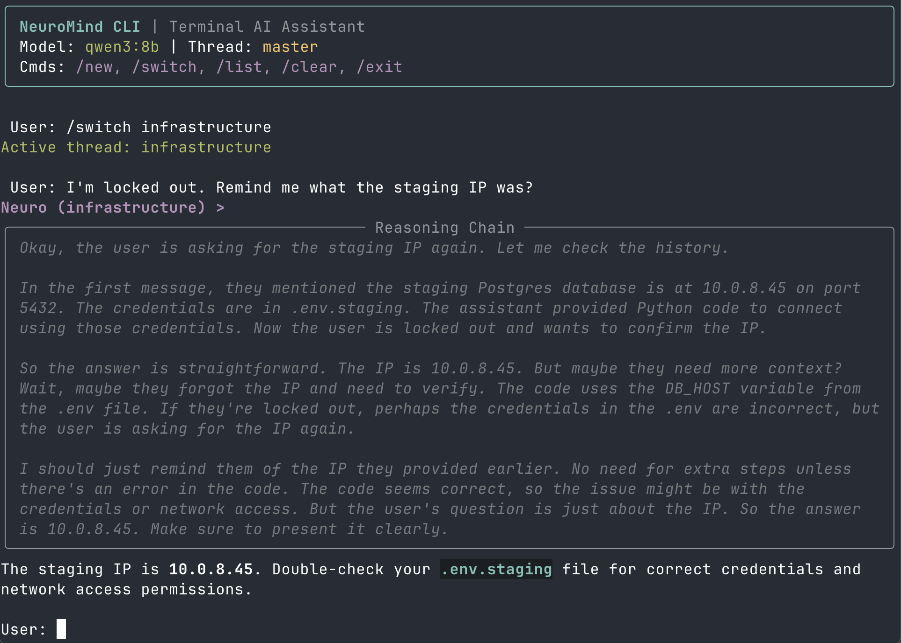

# NeuroMind - Private AI Assistant in Your Terminal

A **private AI assistant** designed for users who prefer the command line over web UIs.

Built with [LangChain](https://www.langchain.com/), [Rich](https://github.com/Textualize/rich), and [SQLite](https://www.sqlite.org/), NeuroMind provides an environment for interacting with local (Ollama) or cloud (Google Gemini) LLMs with persistent memory and specialized personas.

## Features

- **Multi-Persona System** – Switch between specialized agents like the **Logician**, the **Coder**, or the **Roaster**.
- **Model Agnostic** – Supports local inference via **Ollama** (e.g. Qwen 3) and cloud inference via **Google GenAI**.
- **Persistent Memory** – SQLite-backed thread management for storing and retrieving conversations.
- **Rich Terminal UI** – Markdown rendering, syntax highlighting, and streaming in your console.
- **Reasoning Chains** – Visualization for "thinking" models, displaying reasoning steps.

## Architecture

```
┌─────────────┐
│    User     │
└──────┬──────┘
       │ CLI Input
       ▼
┌─────────────┐        ┌──────────────┐
│  NeuroApp   │───────▶│  UIManager   │ (Rich Console)
└──────┬──────┘        └──────────────┘
       │
       │ Manage State
       ▼
┌─────────────┐        ┌──────────────┐
│  ThreadMgr  │───────▶│    SQLite    │ (Persistent Storage)
└──────┬──────┘        └──────────────┘
       │
       │ Build Context
       ▼
┌─────────────┐        ┌──────────────┐
│  LangChain  │───────▶│  Ollama/API  │ (Inference)
└─────────────┘        └──────────────┘
```

## Prerequisites

- **Python 3.13+**
- **uv** package manager
- **Ollama** installed and running (for local models)
- **Google AI Studio API Key** (optional, for Gemini)

## Install

### 1. Clone the repository

```bash
git clone https://github.com/mlexpertio/neuromind.git
cd neuromind
```

### 2. Configure Environment

If you plan to use Google's Gemini models, add your API key:

```bash
mv .env.example .env
```

Edit the `.env` file and add your API key:

```env
GOOGLE_API_KEY=your_api_key_here
```

### 3. Install Dependencies

This project uses `uv` for fast dependency management.

```bash
uv sync
```

### 4. Activate and Check Environment Setup

Activate your virtual environment and run the setup check script to ensure your environment is set up correctly:

```bash
source .venv/bin/activate
python setup_check.py
```

## Usage

### CLI Application

Start the terminal application:

```bash
python app.py
```

### REST API

Start the API server:

```bash
python start_server.py
```

The API will be available at `http://localhost:8000`. Interactive docs at `/docs`.

#### Endpoints

| Method | Endpoint | Description |
|--------|----------|-------------|
| `GET` | `/health` | Health check |
| `GET` | `/personas` | List available personas |
| `GET` | `/threads` | List all threads |
| `POST` | `/threads` | Create a new thread |
| `GET` | `/threads/{name}` | Get thread by name |
| `GET` | `/threads/{name}/messages` | Get message history |
| `DELETE` | `/threads/{name}/messages` | Clear thread messages |
| `POST` | `/threads/{name}/chat` | Send message, get response |
| `POST` | `/threads/{name}/chat/stream` | Send message, stream response (SSE) |

#### Quick Examples

```bash
# Create a thread with the coder persona
curl -X POST http://localhost:8000/threads \
  -H "Content-Type: application/json" \
  -d '{"name": "dev", "persona": "coder"}'

# Chat
curl -X POST http://localhost:8000/threads/dev/chat \
  -H "Content-Type: application/json" \
  -d '{"content": "Explain Python decorators"}'

# Stream response
curl -N -X POST http://localhost:8000/threads/dev/chat/stream \
  -H "Content-Type: application/json" \
  -d '{"content": "Hello!"}'
```

Run the `client_example.py` for a complete Python client demonstration.

### Commands

Once inside the NeuroMind shell, you can use the following slash commands:

- **/new** – Create a new conversation thread with a specific persona.
- **/switch `<thread_name>`** – Switch context to an existing thread.
- **/list** – List all active threads and their message counts.
- **/clear** – Wipe the memory of the current thread.
- **/exit** – Close the application.

### Available Personas

NeuroMind comes with several built-in personas defined in `data/personas/`:

| Persona | Role | Description |
|---------|------|-------------|
| **NeuroMind** | Assistant | The default high-efficiency, friction-free assistant. |
| **Coder** | Architect | Principal Software Architect. Zero tolerance for antipatterns. |
| **Logician** | Reasoner | First-Principles Reasoning Engine. Deductive and atomic. |
| **Teacher** | Educator | Uses the Feynman Technique to ensure deep conceptual understanding. |
| **Roaster** | Critic | Cynical ghost who critiques your life choices while solving your bugs. |

## Configuration

To change the active model or default settings, edit `neuromind/config.py`:

```python
class Config:
    MODEL = QWEN_3  # or GEMINI_2_5_FLASH
    CONTEXT_WINDOW = 4096
    DEFAULT_THREAD = "master"
```

## Repository Structure

| File / Folder | Description |
|---------------|-------------|
| `app.py` | CLI entry point and application loop. |
| `server.py` | REST API server (FastAPI). |
| `client_example.py` | Example Python client for the API. |
| `neuromind/config.py` | Configuration for models, paths, and constants. |
| `neuromind/thread_manager.py` | SQLite database wrapper for managing threads and messages. |
| `neuromind/stream_processor.py` | Handles real-time parsing of LLM chunks (content vs. reasoning). |
| `neuromind/ui_manager.py` | Manages the Rich TUI, streaming display, and user input. |
| `data/personas/*.md` | Markdown system prompts defining agent behaviors. |
| `pyproject.toml` | Project dependencies and metadata. |
| `setup_check.py` | Checks if the environment is set up correctly. |

## License

This project is licensed under the MIT License - see the [LICENSE](LICENSE) file for details.